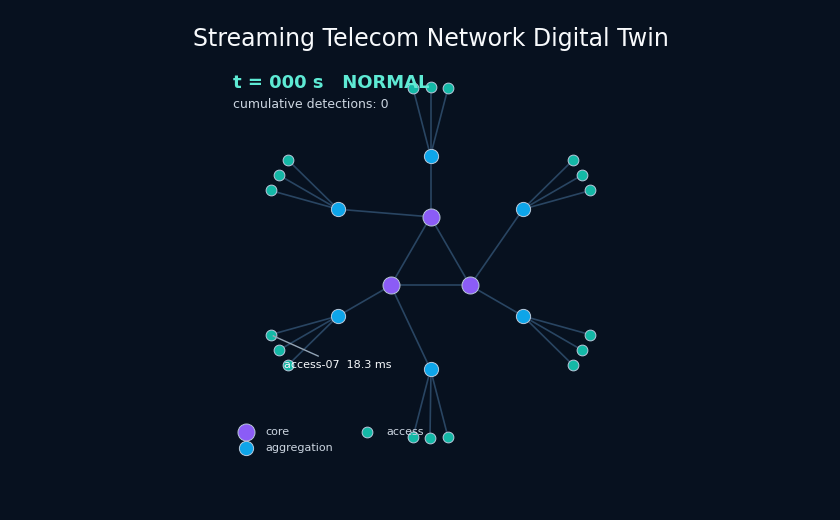
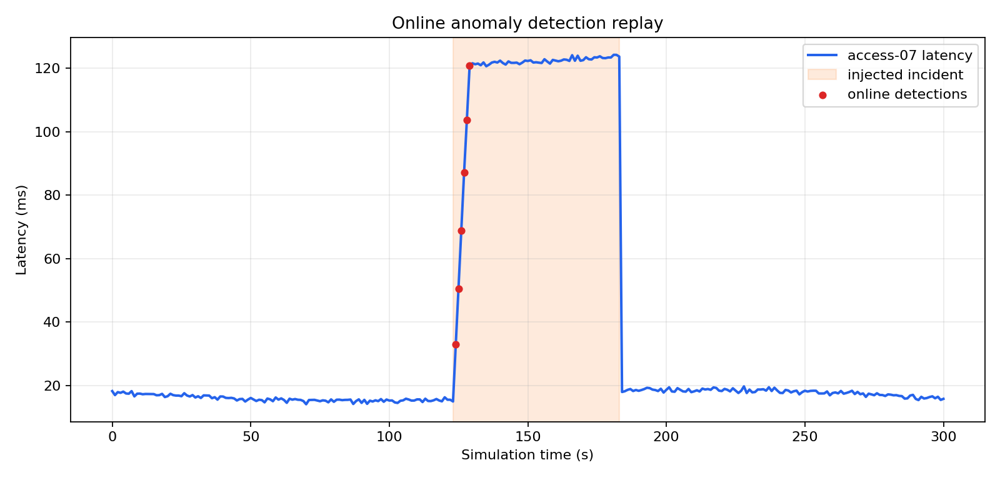
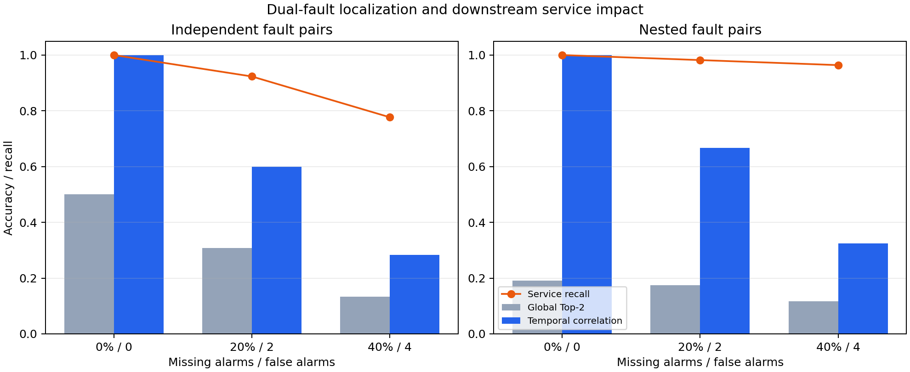

# Telecom Network Digital Twin

## Project timeline and provenance

| Milestone | Date | Scope |
|---|---|---|
| Engineering experience | Jul–Sep 2024 | During my R&D internship, I worked on telecom network-management modules, API/data exchange, and communication-protocol simulation. |
| Public implementation and extension | Aug 2026 | I independently designed and built this 27-node synthetic digital twin, experiments, dashboard, tests, and documentation. |

The repository builds on my internship experience while keeping the public implementation independent: it contains no employer or operator code, data, topology, credentials, endpoints, or other proprietary IP.

A reproducible synthetic telecom-network operations project with hierarchical
topology generation, deterministic telemetry, congestion incident injection,
alarm analysis, management-protocol simulation, online anomaly detection, and
a live FastAPI/SSE digital-twin dashboard.




> **My contribution and data boundary:** I implemented the synthetic topology,
> deterministic telemetry and fault injection, protocol experiments, root-cause
> ranking, FastAPI/SSE dashboard, tests, and quantitative analyses in this public
> version. All identifiers, parameters, topology, and telemetry are synthetic.

## Phase 1 scope

- Deterministic 3-core / 6-aggregation / 18-access topology.
- 301 seconds of one-second telemetry for 27 synthetic nodes.
- Reproducible congestion incident on `access-07` from 123 to 183 seconds.
- Threshold alarms for latency and packet loss.
- Fixed 10-second full polling versus adaptive delta telemetry with a
  30-second heartbeat.
- FastAPI endpoints for health, topology, latest telemetry, alarms, and
  protocol-experiment results.
- CSV artifacts, a deterministic summary figure, unit tests, and GitHub CI.
- Topology-aware root-cause ranking for access, aggregation, and core fault
  propagation with deterministic missing and false alarms.

## Quantitative result

The included 301-second run generates 8,127 samples and 115 threshold alarms.
Both communication strategies detect the injected alarm episode. Compared
with 10-second fixed polling, the adaptive delta strategy:

| Metric | Fixed polling | Adaptive delta | Change |
|---|---:|---:|---:|
| Messages | 837 | 310 | -63.0% |
| Transferred data | 133.9 kB | 24.8 kB | -81.5% |
| First detection delay | 4 s | 0 s | -4 s |
| Mean telemetry staleness | 4.49 s | 13.38 s | +8.89 s |
| P95 telemetry staleness | 9 s | 27 s | +18 s |

This is an explicit bandwidth/freshness tradeoff: adaptive updates reduce
management-plane traffic and react immediately to the injected change, but
unchanged metrics can remain older between 30-second heartbeats.

## Root-cause localization

Phase 2 adds access congestion, aggregation degradation, and core-node failure
scenarios. Alarm observations contain deterministic missing and false alarms.
A transparent topology-aware score balances observed-alarm recall, predicted
impact precision, and whether the candidate itself alarms. The true root ranks
first in all three included scenarios (Top-1 and Top-3 accuracy both 100%).
This small synthetic evaluation demonstrates the method but is not evidence of
production fault-localization accuracy.

## Monte Carlo robustness benchmark

Phase 3 expands the evaluation to **4,860 deterministic trials**: all 27 nodes
as possible roots, 0/20/40% missing alarms, 0/2/4 false alarms, and 20 seeded
repeats per combination. A temporal model assumes downstream alarms propagate
three seconds per hierarchy hop and compares this signal with topology-only
ranking.

| Metric (role-macro average) | Topology only | Topology + time |
|---|---:|---:|
| Top-1 accuracy | 69.56% | **74.75%** |
| Top-3 accuracy | 84.66% | **87.85%** |
| Worst-noise Top-1 | 41.39% | **53.70%** |


The macro average weights access, aggregation, and core tiers equally. Under
40% missing alarms plus four false alarms, temporal Top-1 accuracy is 12.78%
for access roots, 58.33% for aggregation roots, and 90.00% for core roots.
The weak access result is expected: a leaf fault has only one causal alarm, so
losing it leaves little evidence. The repository reports this failure mode
rather than hiding it in a node-count-weighted overall accuracy.

## Live digital twin and online detection

Phase 4 adds a thread-safe replay engine that advances the same 27-node model
one simulated second at a time. Each node maintains its latest telemetry and a
rolling 60-sample baseline. A one-sided z-score detector evaluates latency,
packet loss, and CPU before updating that baseline, after a 30-sample warm-up.

The deterministic 301-second evaluation processes **8,127 node-seconds**. It
detects the declared `access-07` congestion at 124 s, **one second after the
123 s incident start**, with six anomaly events inside the incident and zero
events outside it for this included workload.

| Online evaluation metric | Result |
|---|---:|
| Samples processed | 8,127 |
| Detection delay | **1 s** |
| Incident anomaly events | 6 |
| Non-incident events | 0 |
| False events / 1,000 node-seconds | 0.0 |



The browser dashboard at `/dashboard` renders live topology health and anomaly
events from a Server-Sent Events stream. REST endpoints also support explicit
reset, step, snapshot, and event-feed operations for deterministic testing.

## Multi-fault correlation and service impact

Phase 5 evaluates simultaneous fault analysis instead of assuming every alarm
belongs to one incident. Twelve declared dual-fault scenarios cover independent
branches and nested ancestor/descendant pairs. Each trial injects two alarm
cascades 30 seconds apart, then applies 0/20/40% missing alarms and 0/2/4 false
alarms. The full balanced benchmark contains **2,160 deterministic trials**.

A global baseline ranks two roots from the combined alarm set. The correlation
method first separates temporal incident windows, applies topology-and-time
ranking within each window, and then maps predicted roots to downstream access
service endpoints.

| Dual-fault metric | Global Top-2 | Temporal correlation |
|---|---:|---:|
| Exact two-root match | 23.84% | **63.19%** |
| Root-cause recall | 59.72% | **79.84%** |

The correlated roots recover 94.32% of affected access services with an 84.19%
service-set Jaccard score. Under 40% missing alarms plus four false alarms,
exact root-pair match falls to 30.42% and service recall remains 87.04%. The
stricter worst-case service Jaccard is 60.06% for independent faults and 77.33%
for nested faults; overlapping nested impact sets make recall alone optimistic.



## Quick start

```bash
python3 -m venv .venv
. .venv/bin/activate
python -m pip install -e '.[dev]'
ruff check .
pytest -q
telecom-twin experiment --output-dir results
telecom-twin benchmark --output-dir results --trials-per-root 20
telecom-twin online-evaluation --output-dir results
telecom-twin multi-fault-benchmark --output-dir results --trials-per-scenario 20
telecom-twin demo-gif --output results/figures/live_twin_demo.gif
telecom-twin serve --host 127.0.0.1 --port 8000
```

Interactive API documentation is then available at `http://127.0.0.1:8000/docs`.
The live dashboard is available at `http://127.0.0.1:8000/dashboard`.

## Repository structure

```text
src/telecom_twin/   Domain model, simulator, protocol study, API, and CLI
tests/              Deterministic unit and API tests
results/            Curated metrics and figure
.github/workflows/  Python 3.10/3.12 CI
```

## Limitations

- This is a management-plane abstraction, not an emulator of a carrier core,
  radio-access network, SNMP stack, or production OSS/BSS platform.
- Message sizes and thresholds are declared simulation assumptions, not
  measurements from a real network.
- The first phase uses one injected incident and in-memory API state.
- The adaptive strategy is evaluated only against the included synthetic
  workload; it is not claimed to be universally optimal.
- Phase 3 timing assumes a fixed three seconds per causal hop plus small seeded
  jitter. It demonstrates temporal evidence, not a calibrated network delay model.
- The benchmark covers single faults only. Simultaneous faults, topology errors,
  and alarm suppression policies are not yet modeled.
- Phase 4 is a deterministic in-process replay, not Kafka, an SNMP collector,
  a distributed stream processor, or a production telemetry pipeline.
- The zero false-event count applies only to the included synthetic replay; it
  is not a general false-positive-rate claim or a calibrated production model.
- The dashboard stores state in memory and provides no authentication, durable
  storage, horizontal scaling, or multi-user isolation.
- Phase 5 assumes exactly two faults separated by 30 seconds and uses a fixed
  12-second clustering gap. It does not solve unknown fault counts, overlapping
  start times, flapping alarms, or long-running incident merging.
- Synthetic access nodes stand in for service endpoints; no subscribers,
  traffic classes, SLAs, or real business-impact values are modeled.
- No availability, cybersecurity, or service-level guarantees are implied.

## License

MIT for repository source code. The synthetic results are generated by this
project and do not represent a real company or operator.
